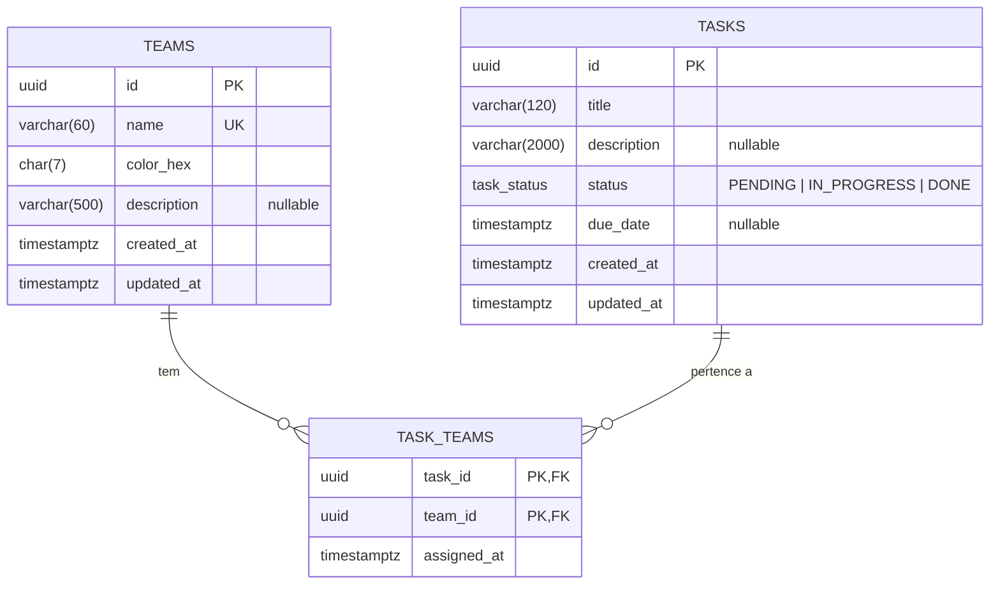

# Times e Tarefas

Monorepo com uma **API REST** (Express + arquitetura hexagonal) e um **app mobile** (Expo + TypeScript + NativeWind) para gestão de times e tarefas, com relacionamento **N:N** entre eles.

```
teams-tasks/
├── apps/
│   ├── api/                 API REST — Express, Prisma, PostgreSQL
│   └── mobile/              App — Expo, Expo Router, NativeWind, React Query
├── packages/
│   └── shared/              Contratos (schemas Zod + tipos) usados pelas DUAS pontas
├── docker-compose.yml       PostgreSQL 16 para desenvolvimento
└── biome.json               Lint + format únicos para todo o monorepo
```

---

## Sumário

- [Stack](#stack)
- [Como rodar](#como-rodar)
- [Decisões arquiteturais](#decisões-arquiteturais)
- [Modelo de dados](#modelo-de-dados)
- [API — contratos e exemplos](#api--contratos-e-exemplos)
- [Testes](#testes)
- [Deploy](#deploy)
- [O que eu faria diferente em produção](#o-que-eu-faria-diferente-em-produção)

---

## Stack

| Camada | Escolha | Por quê |
|---|---|---|
| Monorepo | pnpm workspaces | Um `packages/shared` com os schemas Zod dá tipagem ponta a ponta sem codegen |
| API | Express 5 + TypeScript | Arquitetura hexagonal + Clean Architecture + SOLID, sem framework opinado no caminho |
| Banco | PostgreSQL 16 + Prisma | O N:N entre tarefas e times é relacional puro; migrations versionadas e tipos gerados |
| Validação | Zod | Mesmo schema valida a entrada da API e o formulário do app |
| App | Expo SDK 57 + Expo Router | Rotas por arquivo, tipadas em tempo de compilação |
| Estilo | NativeWind 4 | Requisito: estilização sem `styled-components` |
| Server state | React Query 5 | Cache, invalidação, optimistic updates e persistência offline |
| Formulários | react-hook-form + Zod | Validação declarativa reusando os schemas compartilhados |
| Offline | MMKV (com fallback AsyncStorage) | Cache do React Query sobrevive ao app fechado |
| Lint/format | Biome | Um binário, sem conflito de regras entre linter e formatter |
| Testes | Vitest + Supertest (API), Jest + RNTL (app) | Unitário sem banco; integração com Postgres real |

---

## Como rodar

### Pré-requisitos

- **Node.js 20.11+** (desenvolvido na 24)
- **pnpm 9+** — `npm i -g pnpm`
- **Docker** — para o PostgreSQL
- Para abrir o app: **Expo Go** no celular, um emulador, ou apenas o navegador

### Caminho rápido

```bash
git clone https://github.com/adriangvaldes/teams-tasks.git
cd teams-tasks

pnpm install

cp apps/api/.env.example apps/api/.env

# Sobe o Postgres, aplica as migrations e popula 3 times + 10 tarefas
pnpm setup
```

Depois, em **dois terminais**:

```bash
pnpm dev:api        # API em http://localhost:3333
```

```bash
pnpm dev:mobile     # Metro; tecle "w" para abrir no navegador
```

Confira se a API subiu:

```bash
curl http://localhost:3333/health/ready
# {"data":{"status":"ready","database":"up"}}
```

### O app não precisa de configuração para achar a API

`localhost` significa coisas diferentes em cada alvo, então o app resolve a URL sozinho:

| Alvo | URL usada | Como é descoberta |
|---|---|---|
| Navegador / simulador iOS | `http://localhost:3333` | Padrão |
| Emulador Android | `http://10.0.2.2:3333` | `10.0.2.2` é o host visto de dentro do emulador |
| Celular físico (Expo Go) | `http://<ip-da-sua-maquina>:3333` | Extraído do `hostUri` do Metro |

> No celular físico, o computador e o telefone precisam estar na **mesma rede**, e o firewall do Windows precisa liberar a porta 3333.

### Variáveis de ambiente do app: EAS

O app tem **uma** variável, `EXPO_PUBLIC_API_URL`, e ela é opcional em desenvolvimento — a resolução automática acima cobre esse caso. Ela existe para apontar o app a um backend publicado.

O valor não fica em arquivo versionado nem circula por mensagem: mora nas **environment variables do EAS**, por ambiente (`development`, `preview`, `production`). Quem clona faz um *pull*:

```bash
cd apps/mobile
pnpm env:pull          # baixa o ambiente development para .env.local (gitignored)
pnpm env:list          # confere o que existe em cada ambiente
```

Para definir ou atualizar o valor (feito uma vez, por quem tem acesso ao projeto):

```bash
pnpm dlx eas-cli@22.2.0 env:set \
  --name EXPO_PUBLIC_API_URL \
  --value https://sua-api.up.railway.app \
  --environment production \
  --visibility plaintext
```

`plaintext` é intencional e não é descuido: qualquer variável com prefixo `EXPO_PUBLIC_` é **embutida no bundle** pelo Expo. Marcá-la como secreta daria uma falsa sensação de proteção — um segredo de verdade jamais deve usar esse prefixo.

Os perfis do `eas.json` já apontam para o ambiente correspondente, então o build pega o valor sozinho:

```bash
pnpm build:dev        # dev client (habilita o MMKV), ambiente development
pnpm build:preview    # APK interno, ambiente preview
```

O `eas-cli` **não** é dependência do projeto de propósito: ele traz ~317 pacotes e um build script nativo opcional (`dtrace-provider`) que fazia `pnpm install` sair com código 1 no Windows. Os scripts o invocam via `pnpm dlx` com a versão fixada, o que mantém a reprodutibilidade sem contaminar a instalação de quem só quer rodar o projeto.

### Scripts

Na raiz:

| Script | O que faz |
|---|---|
| `pnpm setup` | `install` + `db:up` + `db:migrate` + `seed` |
| `pnpm dev:api` | API em watch mode |
| `pnpm dev:mobile` | Metro bundler |
| `pnpm test` | Testes de todos os pacotes (suíte unitária) |
| `pnpm typecheck` | `tsc --noEmit` em todos os pacotes |
| `pnpm lint` | Biome em `apps` e `packages` |
| `pnpm format` | Biome com `--write` |
| `pnpm db:up` / `db:down` | Sobe/derruba o Postgres |
| `pnpm db:reset` | Recria o volume do banco (apaga tudo) |
| `pnpm db:migrate` | Aplica migrations em desenvolvimento |
| `pnpm seed` | Repopula 3 times e 10 tarefas (idempotente) |

Na API (`pnpm --filter @teams-tasks/api <script>`): `test:unit`, `test:integration`, `test:all`, `test:coverage`, `db:studio`, `db:deploy`, `build`, `start`.

### Offline-first com MMKV

O MMKV é módulo nativo e **não roda no Expo Go**. O app trata isso com uma porta de armazenamento: usa MMKV quando disponível e cai para `AsyncStorage` caso contrário — então `pnpm dev:mobile` funciona sem nenhum build customizado. Para exercitar o MMKV de verdade:

```bash
cd apps/mobile
pnpm dlx eas-cli build --profile development --platform android
```

---

## Decisões arquiteturais

### 1. Por que REST e não GraphQL

O enunciado permitia os dois. Escolhi REST porque, **neste** domínio, GraphQL cobraria complexidade sem entregar o benefício:

- **O grafo tem profundidade 2.** Duas entidades e um N:N raso. O ganho de GraphQL — cliente escolhendo a forma de um grafo profundo — não se materializa.
- **O monorepo já resolveu o problema que GraphQL resolveria.** `packages/shared` exporta os schemas Zod e os DTOs consumidos pelas duas pontas: o contrato é tipado e validado em compile-time *e* em runtime. Codegen de GraphQL brilha quando front e back são repositórios separados — não é o caso.
- **Os diferenciais escolhidos empurram para REST.** Em REST a chave de cache é `['tasks', filtros]`: estável e grossa. Em GraphQL a chave é `documento + variáveis`, o que fragmenta o cache persistido em MMKV; a solução idiomática seria um cache normalizado (Apollo/urql), que **duplicaria o papel do React Query** exigido no enunciado.
- **O envelope de erro é HTTP-nativo.** O contrato pede `{ error: { code, message, details? } }` com status codes. GraphQL responde `200 OK` com `errors[]`.
- **Paginação.** `limit/offset` + `{ data, meta }` é exatamente o que foi pedido; a convenção GraphQL empurraria para Relay connections.

Como o transporte é um **adapter de borda**, adicionar `/graphql` depois seria um adapter novo sobre os mesmos casos de uso — sem tocar em domínio.

### 2. Por que PostgreSQL

- Uma tarefa pertence a **zero ou mais** times e um time tem muitas tarefas: N:N com integridade referencial é o cenário canônico de banco relacional. Em MongoDB isso viraria array de referências mantido à mão.
- Os filtros do enunciado (`teamId`, `status`, `search`, ordenação, paginação, contagem por time) são consultas relacionais com índices.
- O Prisma dá **migrations versionadas**, seed script e tipos gerados — o que atende diretamente o requisito de reprodutibilidade local.

### 3. Camadas do backend

Arquitetura hexagonal (ports & adapters) com as dependências apontando **sempre para dentro**:

```
                    ┌─────────────────────────────────────┐
   HTTP ─────────►  │  interfaces/http                    │  adapters de ENTRADA
                    │  routes · controllers · presenters  │
                    └──────────────┬──────────────────────┘
                                   │ depende de ports/in
                    ┌──────────────▼──────────────────────┐
                    │  application                        │
                    │  use-cases · ports · dtos · mappers │
                    └──────────────┬──────────────────────┘
                                   │ depende de domain
                    ┌──────────────▼──────────────────────┐
                    │  domain                             │
                    │  entities · value objects · errors  │  ZERO dependências
                    └─────────────────────────────────────┘
                                   ▲
                    ┌──────────────┴──────────────────────┐
   Postgres ◄─────  │  infrastructure                     │  adapters de SAÍDA
                    │  prisma · pino · uuid · clock       │  implementa ports/out
                    └─────────────────────────────────────┘
```

```
apps/api/src/
├── domain/                    # Regras de negócio. Não importa Express, Prisma, Zod nem shared.
│   ├── shared/                #   Entity, UniqueEntityId, DomainError
│   ├── team/                  #   Team + TeamName, ColorHex
│   └── task/                  #   Task + TaskTitle, TaskStatus
├── application/
│   ├── ports/in/              # Interfaces UseCase<In, Out> — o que os controllers consomem
│   ├── ports/out/             # TeamRepository, TaskRepository, IdGenerator, Clock, Logger
│   ├── dtos/                  # Entrada e saída por caso de uso
│   ├── mappers/               # domínio → DTO de aplicação
│   ├── services/              # TeamLoader (carregamento em lote)
│   └── use-cases/             # Um arquivo, uma intenção
├── infrastructure/            # Implementações concretas das portas de saída
│   ├── persistence/prisma/    #   repositórios + mappers persistência↔domínio
│   ├── logging/ id/ time/     #   Pino, UUID, Date
│   └── config/                #   env validado com Zod
├── interfaces/http/           # Adapter de entrada
│   ├── controllers/ routes/   #
│   ├── presenters/            #   DTO de aplicação → JSON (Date → ISO 8601)
│   └── errors/                #   DomainError → status HTTP
├── container.ts               # COMPOSITION ROOT — único lugar onde classes concretas se encontram
└── main.ts                    # Bootstrap + graceful shutdown
```

**O que essa separação compra, concretamente:**

- **O domínio é testável sozinho.** 33 testes de invariantes rodam sem banco, sem HTTP, sem mock.
- **Os casos de uso rodam contra fakes em memória.** 35 testes em ~40 ms, porque as portas foram declaradas com tipos de domínio.
- **`Clock` e `IdGenerator` são portas.** Nenhuma camada acima do `main.ts` chama `new Date()` ou gera UUID. Os testes fixam o tempo e afirmam timestamps exatos.
- **O domínio não conhece HTTP.** Ele classifica erros como `VALIDATION`, `NOT_FOUND` ou `CONFLICT`; traduzir para 400/404/409 é trabalho de um único middleware.

**Sem container de DI** (tsyringe, inversify). O wiring é manual no `container.ts`: em um domínio de duas entidades, um container troca validação em tempo de compilação por decorators, metadata de reflexão e erros em runtime.

### 4. Patterns escolhidos no app

| Pattern | Por quê |
|---|---|
| **React Query** | O estado que importa é *server state*: cache, revalidação, invalidação e optimistic updates. Nada de duplicar isso em Redux. |
| **Sem Zustand/Redux** | Depois do React Query, sobrou apenas estado de tela (texto da busca, filtro ativo) — `useState` local resolve. Uma store global aqui seria cerimônia. |
| **Query keys centralizadas** | Toda chave de tarefa começa com `['tasks']`, então uma mutação invalida todas as listas montadas sem precisar saber quais filtros estão ativos. |
| **`useInfiniteQuery`** | Consome a paginação `limit/offset` da API com "carregar mais" ao chegar no fim da lista. |
| **Schema de formulário ≠ schema de request** | No formulário a data é `dd/mm/aaaa` e vazio é `''`; no contrato é ISO 8601 e `null`. As *regras de campo*, porém, vêm de `packages/shared` — o mínimo de 3 caracteres do título é a mesma definição nas duas pontas. |
| **Porta de armazenamento** | Permite MMKV (dev client) e AsyncStorage (Expo Go) sem escolher entre offline-first e "roda com um comando". |

### 5. Optimistic updates

A ação rápida de status responde antes da resposta do servidor, com rollback por snapshot em caso de erro. Dois detalhes separam "otimista" de "otimista e correto":

1. **`isOverdue` é recalculado localmente.** Tarefa concluída não está atrasada — sem isso o rótulo vermelho ficaria na tela até a revalidação.
2. **Listas filtradas por status têm o item removido, não apenas atualizado.** O filtro está na própria query key, então dá para saber que, numa lista "Pendentes", a tarefa que acabou de virar "Concluída" não pertence mais.

---

## Modelo de dados



### Entidades

**Team** — `name` (2–60, único case-insensitive), `colorHex` (`#RRGGBB`, normalizado para maiúscula), `description` opcional.

**Task** — `title` (3–120), `description` opcional, `status` (enum), `dueDate` opcional. `isOverdue` é **calculado**, não persistido: prazo no passado e status diferente de `DONE`.

**TaskTeam** — tabela de junção **explícita**, não relação implícita do Prisma. Motivos: permite atributos no vínculo (`assigned_at`), deixa o N:N visível no modelo lógico, e o `update` de tarefa **reconcilia** o conjunto por diff em vez de apagar e recriar — o que preserva `assigned_at` dos vínculos mantidos.

### Decisões de schema

- **`ON DELETE CASCADE` nos vínculos.** Apagar um time remove os vínculos, **não** as tarefas. Uma tarefa pode existir sem nenhum time, e é isso que "zero ou mais times" significa.
- **`created_at`/`updated_at` sem `DEFAULT now()`.** Os timestamps vêm da porta `Clock`, o que mantém o tempo injetável e os testes determinísticos.
- **IDs gerados pela aplicação**, não pelo banco: a entidade nasce completa em memória e é validável antes de qualquer I/O.
- **`timestamptz`** para eliminar ambiguidade de fuso.
- **Índices** em `status`, `due_date`, `created_at`, `title` e `task_teams.team_id`, cobrindo os filtros e ordenações expostos.

### Migrations e reprodutibilidade

```bash
pnpm db:up          # Postgres 16 no Docker, com healthcheck
pnpm db:migrate     # prisma migrate dev  (desenvolvimento)
pnpm seed           # 3 times + 10 tarefas, com IDs fixos
```

- A migration inicial está **versionada** em `apps/api/prisma/migrations/`. Em CI e no deploy roda `prisma migrate deploy` — idempotente e nunca destrutivo.
- O **seed passa pelas entidades de domínio e pelos repositórios**, não por inserts crus: se uma invariante mudar, o seed quebra junto e nunca produz dado que a aplicação rejeitaria.
- Os **IDs do seed são fixos**, o que torna a repopulação idempotente e faz os `curl` abaixo funcionarem copiando e colando.
- Os testes de integração usam o **mesmo container** em um **schema separado** (`integration_test`), então rodar a suíte nunca apaga os dados do seed.

---

## API — contratos e exemplos

Base: `http://localhost:3333`

Toda resposta de sucesso é `{ data, meta? }`. Toda falha é `{ error: { code, message, details? } }`.

| Código | HTTP | Quando |
|---|---|---|
| `VALIDATION_ERROR` | 400 | Payload ou query inválidos |
| `NOT_FOUND` | 404 | Recurso (ou rota) inexistente |
| `CONFLICT` | 409 | Nome de time já em uso |
| `INTERNAL_ERROR` | 500 | Falha inesperada |

### Endpoints

| Método | Rota | Descrição |
|---|---|---|
| `GET` | `/health` | Liveness — não consulta o banco |
| `GET` | `/health/ready` | Readiness — verifica a conexão |
| `GET` | `/api/teams` | Lista times · `search` `limit` `offset` `sort` |
| `POST` | `/api/teams` | Cria time |
| `GET` | `/api/teams/:id` | Detalhe do time (com `taskCount`) |
| `PUT` | `/api/teams/:id` | Atualização parcial |
| `DELETE` | `/api/teams/:id` | Remove time (desvincula tarefas) |
| `GET` | `/api/tasks` | Lista tarefas · `teamId` `status` `search` `limit` `offset` `sort` |
| `POST` | `/api/tasks` | Cria tarefa |
| `GET` | `/api/tasks/:id` | Detalhe da tarefa |
| `PUT` | `/api/tasks/:id` | Atualização parcial |
| `PATCH` | `/api/tasks/:id/status` | **Ação rápida**: altera apenas o status |
| `DELETE` | `/api/tasks/:id` | Remove tarefa |

**Ordenação** — valores fechados, no formato `campo:direção`:
- Times: `name:asc` (padrão), `name:desc`, `createdAt:asc`, `createdAt:desc`
- Tarefas: `createdAt:desc` (padrão), `createdAt:asc`, `dueDate:asc|desc`, `title:asc|desc`, `status:asc|desc`

**Paginação** — `limit` (padrão 20, máximo 100) e `offset` (padrão 0). O `meta` traz `total`, `limit`, `offset` e `hasMore`.

**Semântica de `PUT`** — atualização parcial. Campo **ausente** preserva o valor; campo enviado como **`null`** limpa. `teamIds` **substitui** o conjunto de times.

### Exemplos

<details open>
<summary><b>Listar times com metadata</b></summary>

```bash
curl -s "http://localhost:3333/api/teams?limit=2" | jq
```

```json
{
  "data": [
    {
      "id": "22222222-2222-4222-8222-222222222222",
      "name": "Design System",
      "colorHex": "#DB2777",
      "description": "Componentes, tokens e acessibilidade",
      "taskCount": 2,
      "createdAt": "2026-08-20T18:04:11.201Z",
      "updatedAt": "2026-08-20T18:04:11.201Z"
    },
    {
      "id": "33333333-3333-4333-8333-333333333333",
      "name": "Plataforma",
      "colorHex": "#059669",
      "description": "Infraestrutura, CI/CD e observabilidade",
      "taskCount": 4,
      "createdAt": "2026-08-20T18:04:11.201Z",
      "updatedAt": "2026-08-20T18:04:11.201Z"
    }
  ],
  "meta": { "total": 3, "limit": 2, "offset": 0, "hasMore": true }
}
```
</details>

<details>
<summary><b>Criar time</b></summary>

```bash
curl -s -X POST http://localhost:3333/api/teams \
  -H 'Content-Type: application/json' \
  -d '{"name":"Squad Beta","colorHex":"#7c3aed","description":"Time de growth"}' | jq
```

`201 Created` — note que `colorHex` volta normalizado para maiúscula.
</details>

<details>
<summary><b>Nome de time duplicado → 409</b></summary>

```bash
curl -s -X POST http://localhost:3333/api/teams \
  -H 'Content-Type: application/json' \
  -d '{"name":"squad alpha","colorHex":"#111111"}' | jq
```

```json
{
  "error": {
    "code": "CONFLICT",
    "message": "Já existe um time chamado \"squad alpha\"",
    "details": [{ "path": "name", "message": "Já existe um time chamado \"squad alpha\"" }]
  }
}
```

A unicidade é **case-insensitive**: para o usuário, "Squad Alpha" e "squad alpha" são o mesmo time.
</details>

<details>
<summary><b>Filtrar tarefas por time e status, com busca</b></summary>

```bash
curl -s "http://localhost:3333/api/tasks?teamId=33333333-3333-4333-8333-333333333333&status=PENDING&search=indices&sort=dueDate:asc" | jq
```

```json
{
  "data": [
    {
      "id": "a0000005-0000-4000-8000-000000000005",
      "title": "Revisar indices de busca de tarefas",
      "description": "Avaliar pg_trgm para o filtro de busca textual.",
      "status": "PENDING",
      "dueDate": "2026-08-19T18:00:00.000Z",
      "teams": [
        { "id": "33333333-3333-4333-8333-333333333333", "name": "Plataforma", "colorHex": "#059669" }
      ],
      "isOverdue": true,
      "createdAt": "2026-08-20T18:04:11.310Z",
      "updatedAt": "2026-08-20T18:04:11.310Z"
    }
  ],
  "meta": { "total": 1, "limit": 20, "offset": 0, "hasMore": false }
}
```

Os times vêm **embutidos** na tarefa de propósito: a lista renderiza o chip de cor sem um request extra, e sem N+1 no servidor (uma consulta resolve os times de toda a página).
</details>

<details>
<summary><b>Criar tarefa em dois times</b></summary>

```bash
curl -s -X POST http://localhost:3333/api/tasks \
  -H 'Content-Type: application/json' \
  -d '{
        "title": "Integrar app ao deploy",
        "description": "Apontar EXPO_PUBLIC_API_URL para o Railway",
        "status": "IN_PROGRESS",
        "dueDate": "2026-09-15T18:00:00.000Z",
        "teamIds": [
          "11111111-1111-4111-8111-111111111111",
          "33333333-3333-4333-8333-333333333333"
        ]
      }' | jq
```
</details>

<details>
<summary><b>Ação rápida: marcar como concluída</b></summary>

```bash
curl -s -X PATCH http://localhost:3333/api/tasks/a0000001-0000-4000-8000-000000000001/status \
  -H 'Content-Type: application/json' \
  -d '{"status":"DONE"}' | jq '.data | {title, status, isOverdue}'
```

```json
{ "title": "Implementar tela de listagem de tarefas", "status": "DONE", "isOverdue": false }
```
</details>

<details>
<summary><b>Limpar campos e trocar os times (PUT parcial)</b></summary>

```bash
curl -s -X PUT http://localhost:3333/api/tasks/a0000007-0000-4000-8000-000000000007 \
  -H 'Content-Type: application/json' \
  -d '{"description": null, "teamIds": []}' | jq '.data | {title, description, teams}'
```

`description` foi limpa e a tarefa ficou sem time. O `title` foi preservado porque não veio no payload.
</details>

<details>
<summary><b>Validação: título curto → 400 com details por campo</b></summary>

```bash
curl -s -X POST http://localhost:3333/api/tasks \
  -H 'Content-Type: application/json' \
  -d '{"title":"ab","dueDate":"ontem"}' | jq
```

```json
{
  "error": {
    "code": "VALIDATION_ERROR",
    "message": "Requisição inválida",
    "details": [
      { "path": "title", "message": "Título deve ter ao menos 3 caracteres" },
      { "path": "dueDate", "message": "Data de vencimento deve ser uma data ISO 8601 válida" }
    ]
  }
}
```

Todos os campos inválidos voltam de uma vez, e não apenas o primeiro: é o que permite ao formulário do app marcar tudo em um único submit. O app usa esse `path` para posicionar cada mensagem sob o campo correto.
</details>

<details>
<summary><b>Time inexistente ao vincular → 404</b></summary>

```bash
curl -s -X POST http://localhost:3333/api/tasks \
  -H 'Content-Type: application/json' \
  -d '{"title":"Tarefa órfã","teamIds":["99999999-9999-4999-8999-999999999999"]}' | jq
```

```json
{
  "error": {
    "code": "NOT_FOUND",
    "message": "Time(s) não encontrado(s): 99999999-9999-4999-8999-999999999999",
    "details": [{ "path": "teamIds", "message": "Um ou mais times informados não existem" }]
  }
}
```

A integridade referencial é checada na aplicação para produzir um erro legível, em vez de um erro cru de foreign key.
</details>

> Para importar no Insomnia/Postman, cada exemplo acima é um `curl` completo — os clientes importam `curl` colado direto.

---

## Testes

```bash
pnpm test                                       # suíte unitária de todos os pacotes
pnpm --filter @teams-tasks/api test:unit         # domínio + casos de uso (sem banco)
pnpm --filter @teams-tasks/api test:integration  # HTTP + Postgres reais (precisa de Docker)
pnpm --filter @teams-tasks/api test:coverage
pnpm --filter @teams-tasks/mobile test           # componentes
```

**Unitários (68 testes, ~400 ms)** — domínio e casos de uso contra fakes em memória das portas de saída. Sem Docker, sem banco. Cobrem o que regride em silêncio: filtros combinados, semântica de `undefined` vs `null`, idempotência do `changeStatus`, `isOverdue` de tarefa concluída, e **ausência de N+1 verificada por spy** (uma única chamada ao repositório resolve os times de toda a página, com ids deduplicados).

**Integração** — sobem o app **real** (mesmo composition root, mesmos middlewares, mesmo Prisma) e falam com ele via Supertest, sem abrir socket. As migrations são aplicadas com `migrate deploy`, o mesmo comando de produção: a suíte valida os arquivos versionados, não um schema empurrado por `db push`.

---

## Deploy

A API tem `Dockerfile` multi-stage e `railway.json` prontos. O build é feito **a partir da raiz** do monorepo, porque o contexto precisa incluir `packages/shared`:

```bash
docker build -f apps/api/Dockerfile -t teams-tasks-api .
```

No Railway: crie o projeto a partir do repositório, adicione um **PostgreSQL**, e a variável `DATABASE_URL` já vem preenchida pelo próprio serviço. O `CMD` aplica `prisma migrate deploy` antes de subir o servidor, e o healthcheck aponta para `/health` (liveness, que não consulta o banco — se consultasse, uma indisponibilidade momentânea do Postgres causaria restart em loop).

Com a API publicada, aponte o app para ela em `apps/mobile/.env`:

```bash
EXPO_PUBLIC_API_URL=https://<seu-app>.up.railway.app
```

---

## O que eu faria diferente em produção

Escolhas que foram deliberadamente simplificadas para o escopo deste teste:

**Autenticação e autorização.** Hoje a API é aberta. Em produção: JWT com refresh token, escopo por usuário e por time, e rate limiting por IP e por conta (`express-rate-limit` com store em Redis, não em memória — memória não sobrevive a mais de uma instância).

**Busca textual.** `ILIKE '%termo%'` não usa índice B-tree e degrada linearmente. O passo seguinte é `pg_trgm` com índice GIN, e, se a busca virar um recurso de primeira classe, um índice `tsvector` com ranking.

**Paginação por cursor.** `limit/offset` foi pedido no enunciado e está correto aqui, mas `OFFSET` grande faz o Postgres varrer e descartar linhas. Com volume, paginação por cursor (keyset) sobre `(created_at, id)` — o desempate por `id` que já existe na ordenação é justamente o que viabiliza isso.

**Cache.** Redis na listagem de times (muda pouco, é lida em toda tela) com invalidação nas mutações, mais `ETag`/`If-None-match` nos GETs de detalhe para o cliente reaproveitar resposta com 304.

**Observabilidade.** Os logs já são JSON estruturado com Pino. Faltam: `x-request-id` propagado e correlacionado em cada log, tracing distribuído (OpenTelemetry) para ver o tempo gasto no Postgres, métricas de latência por rota (p95/p99) e alerta em taxa de erro. Erros não tratados para um agregador (Sentry) em vez de só no stdout.

**Escala.** O `PrismaClient` já usa pool; em várias instâncias, um pooler externo (PgBouncer, ou o pooler do provedor) evita esgotar as conexões do Postgres. Réplica de leitura para as listagens. Fila (BullMQ) para o que não precisa ser síncrono — notificação de prazo, por exemplo.

**Segurança.** `CORS_ORIGIN` fixo na origem do app em vez de `*`. Helmet já está no lugar. Auditoria de quem alterou o quê (tabela de eventos ou `pgaudit`), e segredos em um gerenciador (não em `.env` no servidor).

**Banco.** Backup com PITR e restauração testada de verdade. Constraint de exclusividade case-insensitive no banco (`CREATE UNIQUE INDEX ON teams (lower(name))`) — hoje a regra é aplicada na aplicação, e o `UNIQUE` do Postgres diferencia maiúsculas.

**Mobile.** Detecção de conectividade real com `@react-native-community/netinfo` alimentando o `onlineManager` do React Query (hoje o app assume online e trata a falha quando ela ocorre); fila de mutações offline com replay ao reconectar; Sentry com source maps; EAS Update para correções sem passar pela loja; e testes E2E (Maestro ou Detox) no fluxo crítico de criar e concluir tarefa.

**CI.** GitHub Actions rodando `typecheck`, `lint`, unitários e integração (com Postgres em service container) em cada PR, e deploy automático no merge — com a migration aplicada antes do rollout do novo código.
